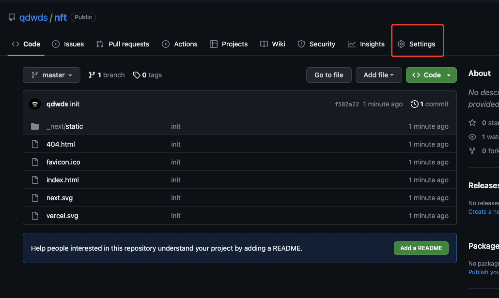
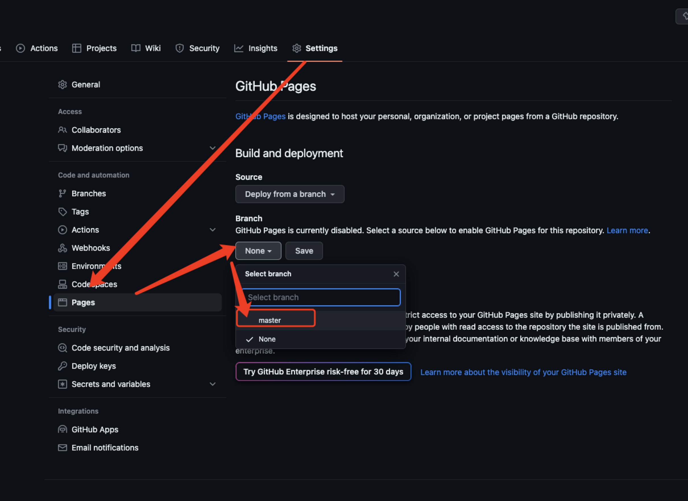

# 部署项目到github

## 修改配置文件
next.config.js
```
const nextConfig = {
    ...,
    trailingSlash: true //  增加配置命令 防止部署404
}

```
## 项目打包

```
npm run build 
```

## 配置命令
在package.json中配置新命令
```
"scripts": {
    ...
    "export": "next export"
  },
```
## 执行命令
```
npm run export 
```
完事就会有一个创建一个`out`目录，这个打包出来的就是一个静态页面。
?> `export 是基于 build出来的文件打包的`所以export之前要想build。

## 代码推到github

```
cd ./out

git init 


git add .

git commit -m 'init'

//  这里要先自己创建一个github仓库

git remote add origin https://github.com/qdwds/nft.git

git push -u origin master
```
完成上面git命令之后代码，如果不出意外的话代码就回推到github上。

## 配置github
点击stting


按照顺序点击,最后选中index.html页面存在的分支，点击save。等待。。。。
