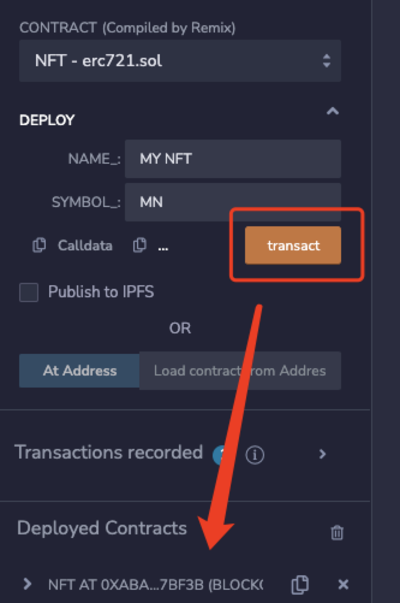
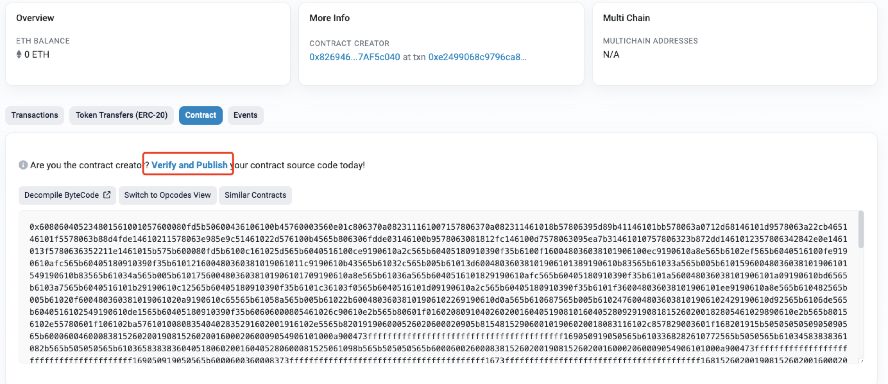
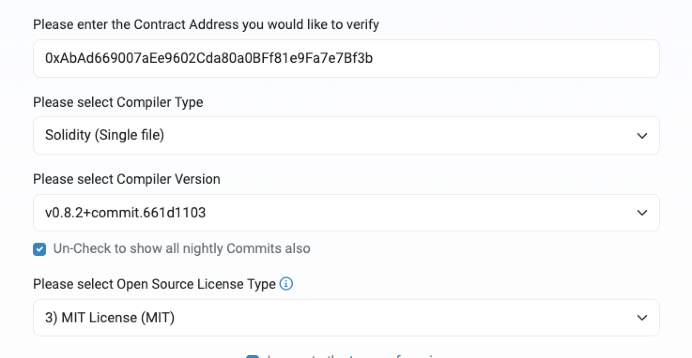
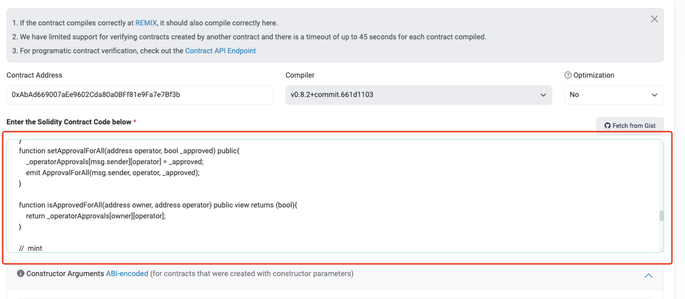
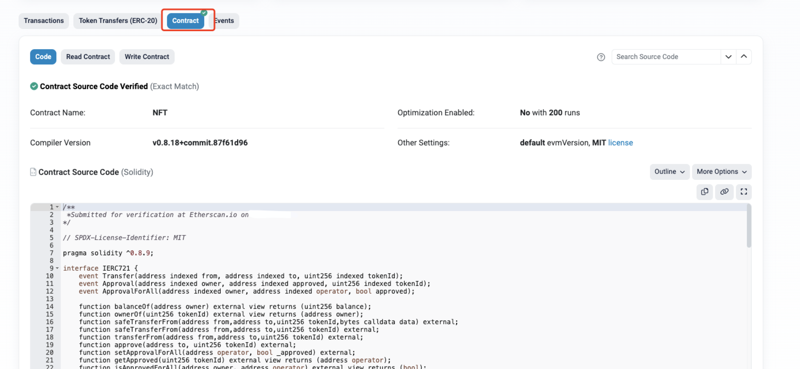

## 代码开源验证
智能合约是可以开源或者可以选择不开源的，当然如果我们想要增加项目的可信度。一般项目都会选择开源的，接下来实现一下合约开源验证。

!>项目部署到那个链上就需要在那个链上进行验证，前提是`合约已经被部署`并且之前代码未做改动才能验证成功!
## remix
1.在remixt中部署合约拿到合约地址


2.打开scan官网,找到自己部署的合约，选择验证合约


3.选择合约部署时候对应的版本信息


4.把当前合约地址复制到框框内


5.再次搜索地址就会发现合约代码已经开源了

## hardhat手动
1.合约代码扁平化,这样可以把多个代码合成一个代码
```typescript 
npx hardhat flatten contracts/ERC721.sol >> erc721.sol 
```
2.使用hardhat合约部署
3.和remix一样从第二步开始往下


