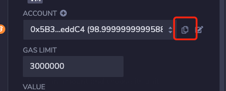
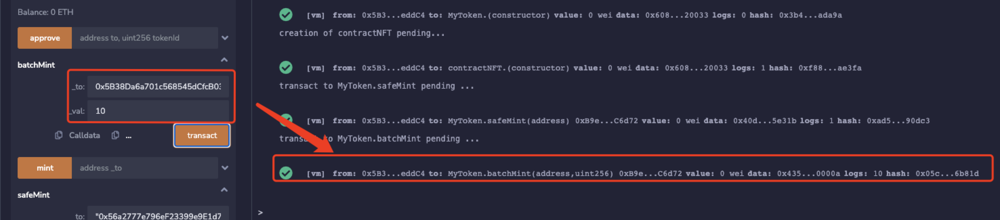

# 批量创建
批量mintNFT的时候，一次性最大mint数量是2**16，否则会返回报错。同时mint的是要切记条件控制

## 自动增加
每次mintNFT的时候想要设置NFT数量自动增加，首先需要设置根_baseURI的地址，然后在mint的时候动态的修改NFT的当前数量值。

```solidity
    //  设置根地址
    function _baseURI() internal pure override returns (string memory) {
        return "https://raw.githubusercontent.com/qdwds/NFT-metadata/master/metadata/donkey/json/";
    }


    //  根据传入的tokenId，动态的拼接uri
    function _setURI(uint256 _tokenId) public pure returns(string memory uri){
        uri = string(abi.encodePacked(_tokenId.toString(),".json"));
    }
```

## 完整代码
```solidity
// SPDX-License-Identifier: MIT
pragma solidity ^0.8.9;

import "@openzeppelin/contracts/token/ERC721/ERC721.sol";
import "@openzeppelin/contracts/token/ERC721/extensions/ERC721URIStorage.sol";
import "@openzeppelin/contracts/utils/Counters.sol";
import "@openzeppelin/contracts/utils/Strings.sol";


contract MyToken is ERC721, ERC721URIStorage {
    using Counters for Counters.Counter;
    using Strings for uint256;
    Counters.Counter private _tokenIdCounter;

    constructor() ERC721("MyToken", "MTK") {
        _tokenIdCounter.increment();
    }

    function _baseURI() internal pure override returns (string memory) {
        return "https://raw.githubusercontent.com/qdwds/NFT-metadata/master/metadata/donkey/json/";
    }

    function safeMint(address to) public {
        _mints(to);
    }

   
    function batchMint(address _to,uint256 _val) public  {
        require(_val <= 10,"MAX 10");
        for (uint i = 0; i < _val; i++){
            _mints(_to);
        }
    }

    function _mints(address to) internal {
        uint256 tokenId = _tokenIdCounter.current();
        _tokenIdCounter.increment();
        _safeMint(to, tokenId);
        _setTokenURI(tokenId, _setURI(tokenId));
    }

    function _setURI(uint256 _tokenId) public pure returns(string memory uri){
        uri = string(abi.encodePacked(_tokenId.toString(),".json"));
    }
    // The following functions are overrides required by Solidity.
    function _burn(uint256 tokenId) internal override(ERC721, ERC721URIStorage) {
        super._burn(tokenId);
    }

    function tokenURI(uint256 tokenId)
        public
        view
        override(ERC721, ERC721URIStorage)
        returns (string memory)
    {
        return super.tokenURI(tokenId);
    }
}
```

## 调用逻辑
## 调用逻辑
1.复制用户的合约地址



2.传入用户地址和mint数量

