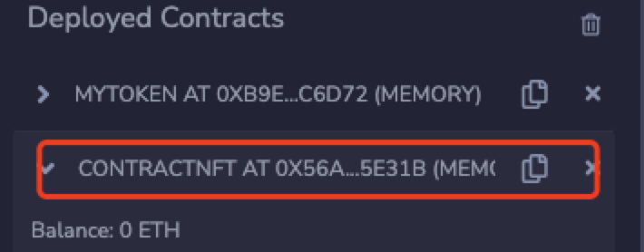
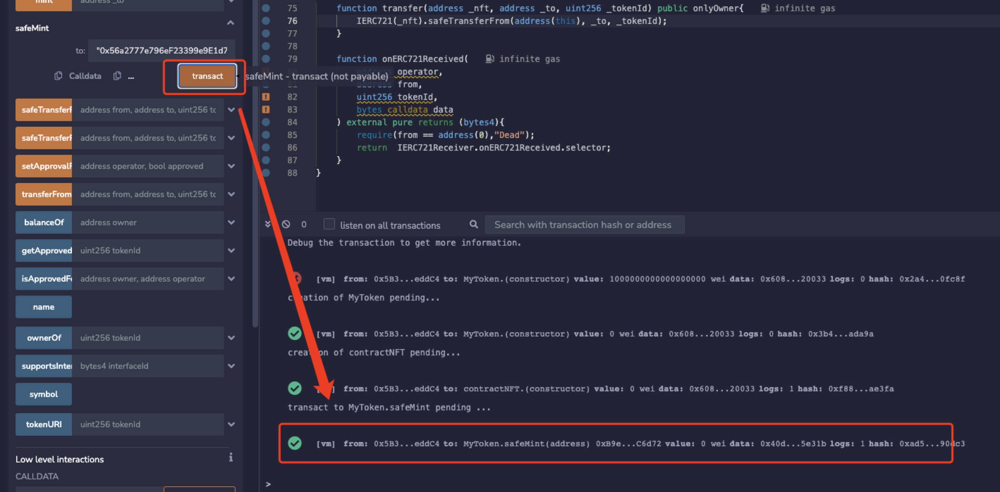

# 合约地址mint
往合约中发送NFT的时候，应该应该使用`safeTransferFrom`转移NFT，而不是使用`transferFrom`来转移NFT.

因为`safeTransferFrom`实现了检查接受合约是否实现了指定的方式`onERC721Received`。这个方法是判断当前合约是否实现了可ERC721的接口，如果没有实现`onERC721Received`方法的合约发送到里面的NFT就会锁定到这个合约中，从此无法取出。

## 代码实现

```solidity
contract contractNFT is IERC721Receiver, Ownable {
    function transfer(address _nft, address _to,uint256 _tokenId) public onlyOwner {
        IERC721(_nft).safeTransferFrom(address(this), _to, _tokenId );
    }
    function onERC721Received( address, address from, uint256, bytes calldata) external pure returns (bytes4) {
      require(from == address(0), "Dead");
      return IERC721Receiver.onERC721Received.selector;
    }
}
```

## 调用逻辑
1.复制接受nft的合约地址



2.传入合约地址点击mint

