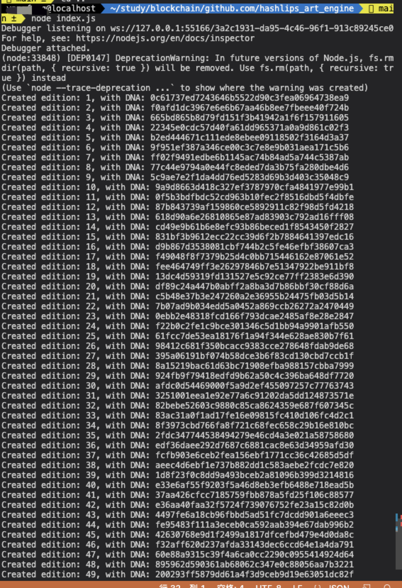

# 批量生成NFT
在创建NFT的时候，我们只需要找到自己想要生成NFT的图片使用[hashlips_art_engine](https://github.com/HashLips/hashlips_art_engine)就可以批量生产自己想要的NFT

## 获取代码
```
git clone https://github.com/HashLips/hashlips_art_engine.git
cd ./hashlips_art_engine   
```

## 配置
该项目可以根据自己的素材生成图片。

### 放置素材
需要生成NFT的素材放入`./layers`文件内即可，里面的文件夹名字可以自己定义。

```
├── layers
│   ├── back
│   │   ├── back#1.png
│   │   ├── back#2.png
│   │   └── back#3.png
│   ├── bg
│   │   ├── bg#001.png
│   │   ├── ....png
│   │   └── bg#050.png
│   ├── eye
│   │   └── eye#1.png
│   ├── lhand
│   │   └── lhand#1.png
│   ├── macolor
│   │   ├── macolor#001.png
│   │   ├── ....png
│   │   └── macolor#051.png
│   ├── malunkuo
│   │   └── mulunkuo#1.png
│   ├── rhand
│   │   ├── rhand#1.png
│   │   ├── rhand#2.png
│   │   └── rhand#3.png
│   └── uphead
│       ├── uphead#1.png
│       ├── uphead#2.png
│       └── uphead#3.png
```

### 配置文件
配置要生的文件在`./src/config.js`中，该文件是生成NFT的总配置文件.只需要修改这个文件即可。

自己导入的文件放到这个目录下面。
```
const layerConfigurations = [
  {
    growEditionSizeTo: 100, //  要生成的图片数量
        layersOrder:[
            {name: "bg"},
            {name: "back"},
            {name: "macolor"},
            {name: "malunkuo"},
            {name: "eye"},
            {name: "uphead"},
            {name: "lhand"},
            {name: "rhand"},
        ]

  },
];
```
### 生成NFT
执行`index.js`等待即可，生成图片的快慢是根据自己生成图片的数量决定的
```js
node ./index.js
```

这样图片就生成了，生成的图片和json文件在`./build`文件中就能找到了，快来试试吧。

