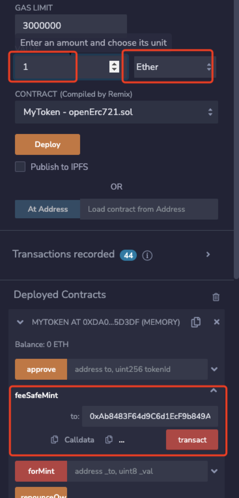

# 付费创建NFT
其实有好多项目都实现了付费mint，实现原理就是在创建的时候通过传入ETH的方式来创建NFT。创建完之后合约中就会有收益，切记需要实现取款方法，否则里面的ETH就会永久锁死在合约里面无法取出。

## 完整代码
```
// SPDX-License-Identifier: MIT
pragma solidity ^0.8.9;

import "@openzeppelin/contracts/token/ERC721/ERC721.sol";
import "@openzeppelin/contracts/token/ERC721/IERC721Receiver.sol";
import "@openzeppelin/contracts/token/ERC721/extensions/ERC721URIStorage.sol";
import "@openzeppelin/contracts/utils/Counters.sol";
import "@openzeppelin/contracts/utils/Strings.sol";
import "@openzeppelin/contracts/access/Ownable.sol";


contract MyToken is ERC721, ERC721URIStorage,Ownable {
    using Counters for Counters.Counter;
    Counters.Counter private _tokenIdCounter;
    using Strings for uint256;
    uint256 fee = 0.1 ether;

    constructor() ERC721("MyToken", "MTK") {
        _tokenIdCounter.increment();
    }

    function _baseURI() internal pure override returns (string memory) {
        return "https://raw.githubusercontent.com/qdwds/NFT-metadata/master/metadata/donkey/json/";
    }

    function _setURI(uint256 _tokenId) internal pure returns(string memory uri) {
        uri = string(abi.encodePacked(_tokenId.toString(),".json"));
    }

    function feeSafeMint(address to) public payable {
        require(msg.value >= fee, "Fee 0.1 ether");
        _mints(to);
    }

    function forMint(address _to, uint8 _val) public payable  {
        require(_val <= 10,"MAX 10");
        require(msg.value >= fee * _val, "Fee 0.1 ether");
        for (uint i = 0; i < _val; i++){
            _mints(_to);
        }
    }
    function _mints(address _to) internal  {
        require(_to != address(0),"Dead");
        uint256 tokenId = _tokenIdCounter.current();
        _tokenIdCounter.increment();
        _safeMint(_to, tokenId);
        _setTokenURI(tokenId, _setURI(tokenId));
    }

    // The following functions are overrides required by Solidity.

    function _burn(uint256 tokenId) internal override(ERC721, ERC721URIStorage) {
        super._burn(tokenId);
    }

    function tokenURI(uint256 tokenId)
        public
        view
        override(ERC721, ERC721URIStorage)
        returns (string memory)
    {
        return super.tokenURI(tokenId);
    }
    function withdraw(address _to) public onlyOwner{
        (bool success,) = _to.call{value:address(this).balance}("");
        require(success, "feild");
    }
}


## 调用逻辑
调用合约之前先传入对应ETH，然后点击mnit方式实现付费mintNFT.

