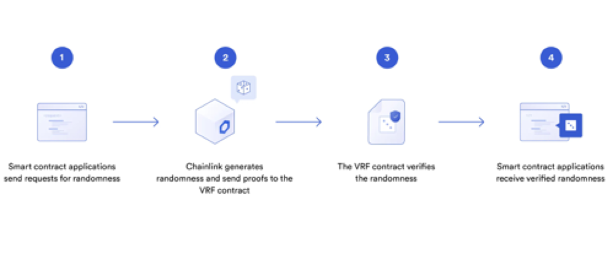

# 随机生成NFT
!> 敲黑板`solidity`无法创建真正意义上的随机数。以太坊每次调用交互函数都是需要`gas`的，所以复杂的运算成本较高。除此之外还有每个节点如果计算随机数是不一致的，其他节点是无法验证随机数的正确性的。

所以一般使用随机数使用的是[chainlink VEF 可验证的随机数](https://docs.chain.link/vrf/v2/introduction/)。这里我会先介绍一下区块链随机数可能存在的问题

## 坏随机数
坏随机数是使用当前任何人拿到的都是一样值的数据做随机数，比如下面案例，使用的是当前调用的`block.number`、`block.timestamp`用作随机值。这种随机数，在同时调用的时候不管是用户调用或者合约调用随机出的值都是一样的。

```solidity
function mint() public pure returns(uint256 random){
    random = uint256(keccak256(abi.encodePacked(blockhash(block.number - 1), block.timestamp))) % 100;
}
```
## 伪随机数
伪随机数和坏随机数一样，都是根据不同的值来生成一套随机数，不过伪随机数使用的是`block.difficulty`等一些假的随机源做随机值。这种随机数外部可以同样是能够验证出来。所以也是不安全的。

```solidity
function mint() public payable {
    uint256 random = uint256(keccak256(abi.encodePacked(block.difficulty, block.timestamp))) % 10;
    console.log(random);
    if (random == 5) {
        ...
    }
}
```
## 模拟随机数
!> 以下案例是使用`伪随机数`，这个案例是存在问题的。只能当作案例不能用作生成
```solidity
// SPDX-License-Identifier: MIT
pragma solidity ^0.8.0;
import "hardhat/console.sol";

contract Random{
    function ran () public view returns(uint256 random){
       random = uint256(keccak256(abi.encodePacked(blockhash(block.number - 1), block.difficulty, block.timestamp))) % 10;
    }
    function mint() public view{
        uint random = ran();
        console.log("random", random);
        // 1 == ssNFT
        // 2 == s级
        if(random == 5){
            console.log("mint NFT");
        }

    }
}

contract Attack{
    function att(Random ran) public  view {
        uint random = uint256(keccak256(abi.encodePacked(blockhash(block.number - 1), block.difficulty, block.timestamp))) % 10;
        console.log(random);
        if(random != 5){
            return ;
        }
        ran.mint();
        console.log("attack random",random);
    }
}
```

## chainlink 随机数
[chainlink](https://docs.chain.link/vrf/v2/introduction/)VRF随机数是链下创建随机值，交给链上合约验证确定可用才发送给合约地址。
> 原理：用户调用chainlink请求随机数 > 链下预言机生成随机数 > 链上VRF合约验证是否指定算法生成的随机数 > 发送随机数给合约.

## 开发本地mock随机数
在使用chainlink随机数的时候，如果一直和链上交互的话，可能会造成时间上的浪费和测试ETH的浪费，所以我们选择本地[mock chainlinkVRF](https://github.com/smartcontractkit/chainlink/blob/develop/contracts/src/v0.8/mocks/VRFCoordinatorV2Mock.sol)随机数，在本地开发使用，等开发完成之后切到测试网络进行测试。

### 下载chainlink
```
npm install @chainlink/contracts
```

### mock合约
```solidity 
<!-- VRFCoordinatorV2Mock.sol -->
pragma solidity ^0.8.4;
import "@chainlink/contracts/src/v0.8/mocks/VRFCoordinatorV2Mock.sol";
```

### 获取随机数合约
```solidity 
// SPDX-License-Identifier: MIT
pragma solidity ^0.8.9;

import "@openzeppelin/contracts/access/Ownable.sol";
import "@openzeppelin/contracts/utils/Counters.sol";
import "@chainlink/contracts/src/v0.8/interfaces/VRFCoordinatorV2Interface.sol";
import "@chainlink/contracts/src/v0.8/VRFConsumerBaseV2.sol";
import "hardhat/console.sol";
contract VRF is  VRFConsumerBaseV2 {
    using Counters for Counters.Counter;
    Counters.Counter private _tokenIdCounter;
    VRFCoordinatorV2Interface COORDINATOR;

    event RequestSent(uint256 requestId, uint32 numWords);

    uint64 s_subscriptionId;    //  subid
    bytes32 keyHash = 0x79d3d8832d904592c0bf9818b621522c988bb8b0c05cdc3b15aea1b6e8db0c15;   //  请求最大的gas费
    uint32 callbackGasLimit = 1000000;   //  gas费上线 link
    uint16 requestConfirmations = 3;    //  等待区块
    uint32 numWords = 30;    //  请求多少随机数


    constructor(uint64 subscriptionId, address _mockAddress) VRFConsumerBaseV2(_mockAddress) {
        COORDINATOR = VRFCoordinatorV2Interface(_mockAddress);
        s_subscriptionId = subscriptionId;
    }


    // 请求随机数
    function requestRandomWords()external returns (uint256 requestId){
        requestId = COORDINATOR.requestRandomWords(
            keyHash,
            s_subscriptionId,   //  subID
            requestConfirmations,   //  经过几个区块验证
            callbackGasLimit,
            numWords
        );
        emit RequestSent(requestId, numWords);
        return requestId;
    }
    //  接收到随机值的回调函数，本地模拟的话需要自己调用。链上由chainlink调用
    function fulfillRandomWords(
        uint256 _requestId,
        uint256[] memory _randomWords
    ) internal override {
       for(uint i = 0; i < _randomWords.length; i++){
            console.log(_randomWords[i]);
       }
    }

}

```

### 合约部署
```

import { parseUnits } from "ethers/lib/utils";
import { ethers } from "hardhat";
const baseFee = parseUnits("0.0001");   //  节点调用的费用
const gasPriceLink = parseUnits("1","gwei");   //  节点调用的费用


const vrf = async() =>{
    const Mock = await ethers.getContractFactory("VRFCoordinatorV2Mock");
    const mock = await Mock.deploy(
        baseFee,
        gasPriceLink
    )
    await mock.deployed();

    const tx = await mock.createSubscription();
    const txReceipt:any = await tx.wait(1);
    const subId = txReceipt.events[0].topics[1];

    // 模拟充值link
    await mock.fundSubscription(subId, parseUnits("10000"));

    const VRF = await ethers.getContractFactory("VRF");
    const vrf = await VRF.deploy(subId, mock.address);
    await vrf.deployed();

    await mock.addConsumer(subId, vrf.address);
    console.log(mock.address);
    console.log(vrf.address);
    
    const result = await vrf.requestRandomWords();
    const vrfTx:any = await result.wait(4);

    const requestId = vrfTx.events[1].args[0];

    await mock.fulfillRandomWords(requestId, vrf.address);
}


vrf()
    .catch(err =>{
        console.log(err);
        process.exit(1);
    })
```

## 获取链上随机数
chainlink 配置随机数 [https://vrf.chain.link/goerli](https://vrf.chain.link/goerli)

link 水龙头🚰 [https://faucets.chain.link/goerli](https://faucets.chain.link/goerli)

## 随机获取NFT
随机NFT是在指定的范围内，更具随机的值创建NFT

## 稀有NFT
根据产生的随机数出现的机率来创建随机数。
比如: b级出现的机率是50%；a级出现的机率是30%；s级出现的机率是20%;
