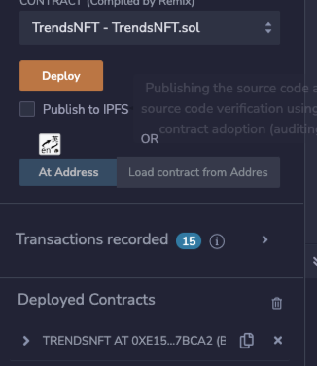
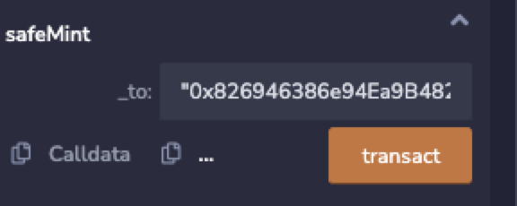
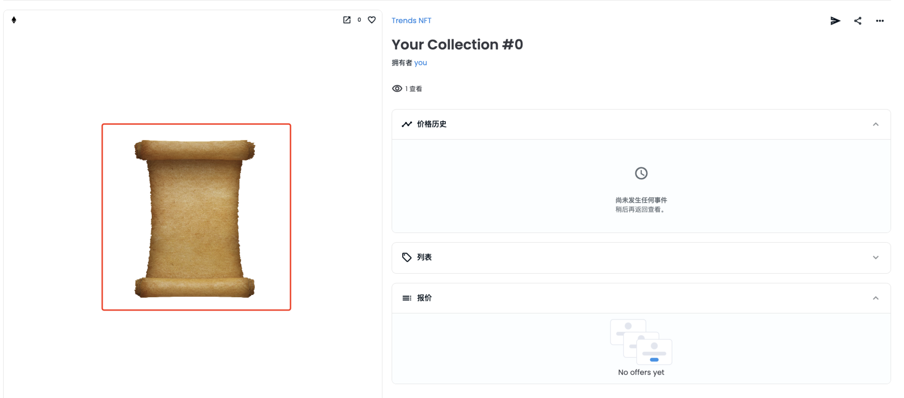
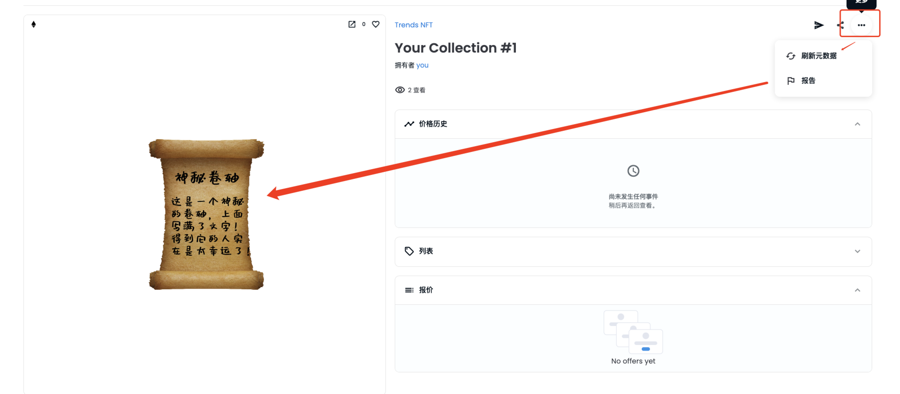

# 动态变换NFT
动态NFT也是NFT中的一种，只过不它能够根据事件、时间、数据、行为等一切可变的条件来修改NFT的状态和数据。

下面案例介绍合约实现一个`动态NFT`，以及部署一个动态NFT到`opensea testnet`上，并且根据数据去动态修改NFT。

## 代码实现
```solidity
// SPDX-License-Identifier: MIT
pragma solidity ^0.8.9;

import "@openzeppelin/contracts/token/ERC721/ERC721.sol";
import "@openzeppelin/contracts/token/ERC721/extensions/ERC721Enumerable.sol";
import "@openzeppelin/contracts/token/ERC721/extensions/ERC721URIStorage.sol";
import "@openzeppelin/contracts/access/Ownable.sol";
import "@openzeppelin/contracts/utils/Counters.sol";
import "@openzeppelin/contracts/utils/Strings.sol";


contract TrendsNFT is ERC721, ERC721Enumerable, ERC721URIStorage, Ownable {
    using Counters for Counters.Counter;
    using Strings for uint8;
    Counters.Counter private _tokenIdCounter;

    constructor() ERC721("Trends NFT", "TN") {}
    mapping(uint256 => string) tokenIdToData;
    struct NFT{
        string uri;
        string data;
    }
    receive() external payable {}

    function _baseURI() internal pure override returns (string memory) {
        return "https://raw.githubusercontent.com/qdwds/NFT-metadata/master/metadata/trends/json/";
    }
    
    function safeMint(address _to) public {
        uint256 tokenId = _tokenIdCounter.current();
        _tokenIdCounter.increment();
        _safeMint(_to, tokenId);
        _setTokenURI(tokenId, _setURI(0));
    }

    function write(uint256 _tokenId, string memory _data)public payable {
        ...
    }

    function clean(uint256 _tokenId) public payable {
        ...
    }

    function withdraw() public {
        ...
    }

    function _setURI(uint8 _index) internal pure returns(string memory uri){
         uri = string(abi.encodePacked(_index.toString(),".json"));
    }
}
```

## 部署
部署动态NFT



mint NFT



查看opensea图片


写入数据


查看opensea图片
> 修改完数据后，等待过程中要记得刷新页面数据，系统不会自动更新


