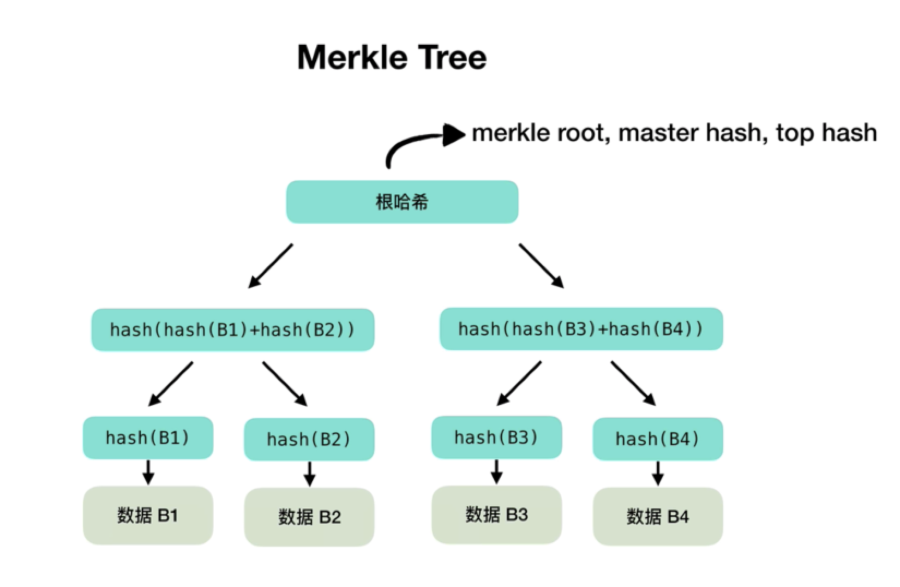

# NFT白名单

## 默克尔树
`Markle Tree` 也叫做默克尔树或者哈希树，是区块链的底层加密技术。Markle Tree是一颗倒立的树，根部在最上面，叶子在下面，每片叶子就对应`数据的哈希`，而且每个叶子的两个节点也是哈希。

默克尔树的原理是将大量数据分割成小块，然后逐层进行哈希运算，最终生成一个根哈希值。具体过程如下：

+ 将要传输的数据分割成`固定大小的块`，每个块的大小可以根据实际需求确定。
+ 对每个块进行哈希运算，得到一个`哈希值`。
+ 将相邻的`两个哈希值进行合并`，形成一个新的哈希值。
+ 重复步骤3，直到最后只剩下一个哈希值，这个哈希值就是默克尔树的根哈希值。



## 智能合约默克尔树白名单
```solidity
// SPDX-License-Identifier: MIT
pragma solidity ^0.8.0;
import "@openzeppelin/contracts/token/ERC721/ERC721.sol";
import "@openzeppelin/contracts/utils/cryptography/MerkleProof.sol";
import "@openzeppelin/contracts/utils/Counters.sol";

contract MerkleTree is ERC721 {
    using Counters for Counters.Counter;
    bytes32 public immutable root; // Merkle树的根
    mapping(address => bool) public whiteLists; // 记录已经mint的地址
    Counters.Counter private _tokenIdCounter;

    // 构造函数，初始化NFT合集的名称、代号、Merkle树的根
    constructor(bytes32 merkleroot) ERC721("nft", "nft") {
        root = merkleroot;
    }

    // 利用Merkle树验证地址并完成mint
    function mint(
        address account,
        bytes32[] calldata proof
    ) external {
        require(_verify(_leaf(account), proof), "Invalid merkle proof"); // Merkle检验通过
        require(!whiteLists[account], "Already minted!"); // 地址没有mint过
        uint256 tokenId = _tokenIdCounter.current();
        _tokenIdCounter.increment();
        _mint(account, tokenId); // mint
        whiteLists[account] = true; // 记录mint过的地址
    }

    // 计算Merkle树叶子的哈希值
    function _leaf(address account) internal pure returns (bytes32) {
        return keccak256(abi.encodePacked(account));
    }

    // Merkle树验证，调用MerkleProof库的verify()函数
    function _verify(bytes32 leaf, bytes32[] memory proof)
        internal
        view
        returns (bool)
    {
        return MerkleProof.verify(proof, root, leaf);
    }
}

```

## 前端实现默克尔树白名单mint
使用到[merkletreejs](https://www.npmjs.com/package/merkletreejs)来验证白名单列表

```ts
import { keccak256 } from "ethers/lib/utils";
import { ethers } from "hardhat"
import { MerkleTree } from "merkletreejs";
const white = [
    "0x70997970C51812dc3A010C7d01b50e0d17dc79C8",
    "0x3C44CdDdB6a900fa2b585dd299e03d12FA4293BC",
    "0x90F79bf6EB2c4f870365E785982E1f101E93b906"
]
const main = async ()=> {
    // 生成MerkleTree
    const leaf = white.map(x => keccak256(x));
    const markletree = new MerkleTree(leaf, keccak256, {sortPairs: true});
    const root = markletree.getHexRoot();
   
    // 部署合约
    const MarkleTree = await ethers.getContractFactory("MarkleTree");
    const tree = await MarkleTree.deploy(root);
    console.log(tree.address);
    await tree.deployed();

    // 白名单 mint
    for (let i = 0; i < white.length; i++) {
        const proof = markletree.getHexProof(leaf[i]);
        await tree.mint(white[i], proof);
        console.log(await tree.whiteLists(white[i]));
    }

    //  不存在的白名单 会报错
    const proof = markletree.getHexProof(leaf[0]);
    await tree.mint("0x71bE63f3384f5fb98995898A86B02Fb2426c5788", proof);
}

main()
    .catch(err =>{
        console.log(err);
        process.exit(1);
    })
```
