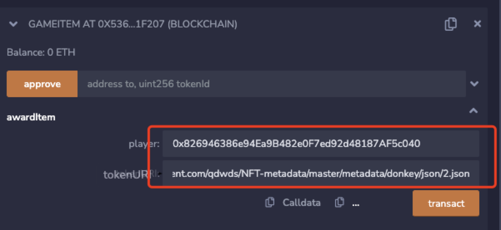

# opensea
> OpenSea 是一个`数字商品交易市场`，允许用户交易非同质化代币（NFT）和其他数字商品。在 OpenSea 上，任何人都可以创建和出售自己的NFT，也可以购买其他用户创建的NFT。允许用户在`全球范围`内进行交易。此外，OpenSea 还为创作者和艺术家提供了一个展示他们作品的平台，让更多人知道和欣赏他们的作品。

## opensea上发行NFT
文档
[https://docs.opensea.io/docs/metadata-standards](https://docs.opensea.io/docs/metadata-standards)

```json
{ 
  "description": "YOUR DESCRIPTION",
  "external_url": "YOUR URL",
  "image": "IMAGE URL",
  "name": "TITLE", 
  "attributes": [
    {
      "trait_type": "Base", 
      "value": "Starfish"
    }, 
    {
      "trait_type": "Eyes", 
      "value": "Big"
    }]
  }
```

## opensea测试网络
[https://testnets.opensea.io/account](https://testnets.opensea.io/account)

## 代码实现
```


// https://raw.githubusercontent.com/qdwds/NFT-metadata/master/metadata/donkey/json/1.json
// contracts/GameItem.sol
// SPDX-License-Identifier: MIT
pragma solidity ^0.8.0;

import "@openzeppelin/contracts/token/ERC721/extensions/ERC721URIStorage.sol";
import "@openzeppelin/contracts/utils/Counters.sol";

contract GameItem is ERC721URIStorage {
    using Counters for Counters.Counter;
    Counters.Counter private _tokenIds;

    constructor() ERC721("GameItem", "ITM") {}

    function awardItem(address player, string memory tokenURI)
        public
        returns (uint256)
    {
        uint256 newItemId = _tokenIds.current();
        _mint(player, newItemId);
        _setTokenURI(newItemId, tokenURI);

        _tokenIds.increment();
        return newItemId;
    }
}

```
### mint nft

