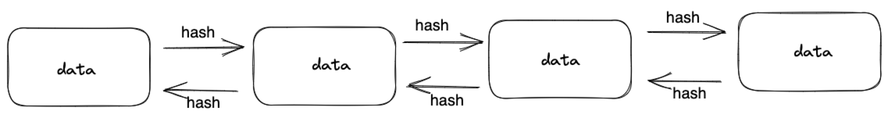

# 什么是区块链

# 区块链
区块链是一种去中心化的分布式账本技术，可用于记录交易和其他数据，并确保其安全性、透明度和不可篡改性。它由许多区块组成，每个区块包含了一些数据以及前一个区块的哈希值。这种设计方式使得区块链具有防篡改、分布式、匿名化等特点，可以实现各种复杂的应用场景，如数字货币、智能合约、投票等。

区块链演示网址：[https://andersbrownworth.com/blockchain/hash](https://andersbrownworth.com/blockchain/hash)