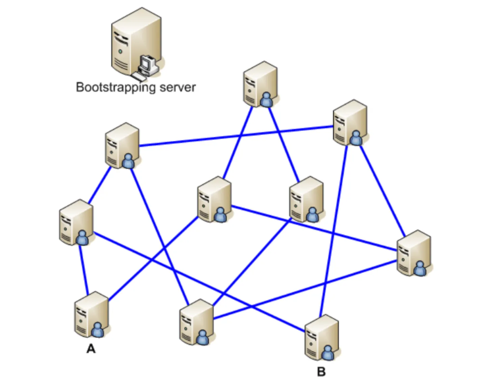
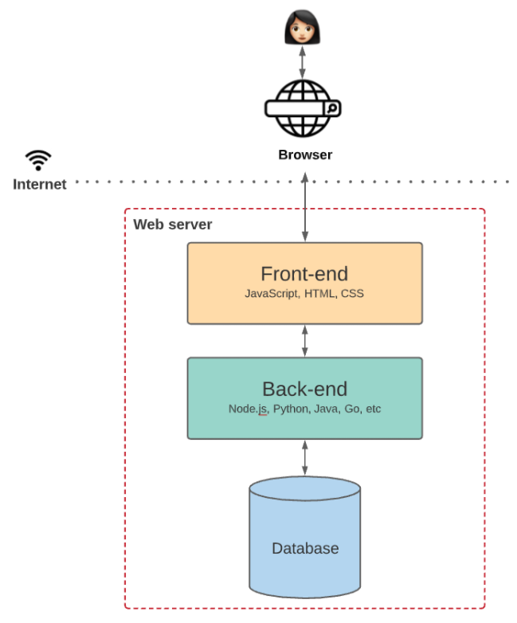
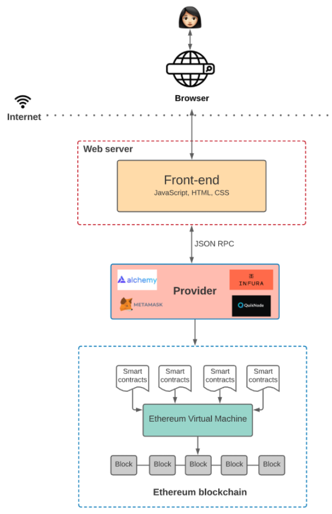

# 什么是web3
## web1/web2/web3的区别
+ Web 1.0，第一代互联网，只能读取数据
+ Web 2.0，第二代互联网，可读、写数据
+ Web 3.0，第三代互联网，可读、可写、可拥有

## web3
Web3是指下一代互联网，旨在通过`分布式技术`和`区块链技术`来重构现有的Web2架构。Web3使得用户可以更加自主地管理其`数据`和`数字身份`，并通过去中心化应用程序（DApps）进行交互和交易。

Web3的主要特点包括：

+ 分布式技术：Web3使用分布式技术来存储和管理数据，这意味着数据不再集中存储在中心化服务器上，而是分布式存储在网络中的许多节点上。

+ 区块链技术：Web3使用区块链技术来确保数据的安全性和可靠性。区块链不仅可以保证数据的不可篡改和透明性，还可以提供智能合约来管理各种复杂的交易和业务逻辑。

+ 去中心化应用程序（DApps）：Web3支持去中心化应用程序（DApps），它们不依赖于单个实体或中心化服务器，而是运行在分布式网络上。这使得用户可以拥有更多的控制权和隐私权。

